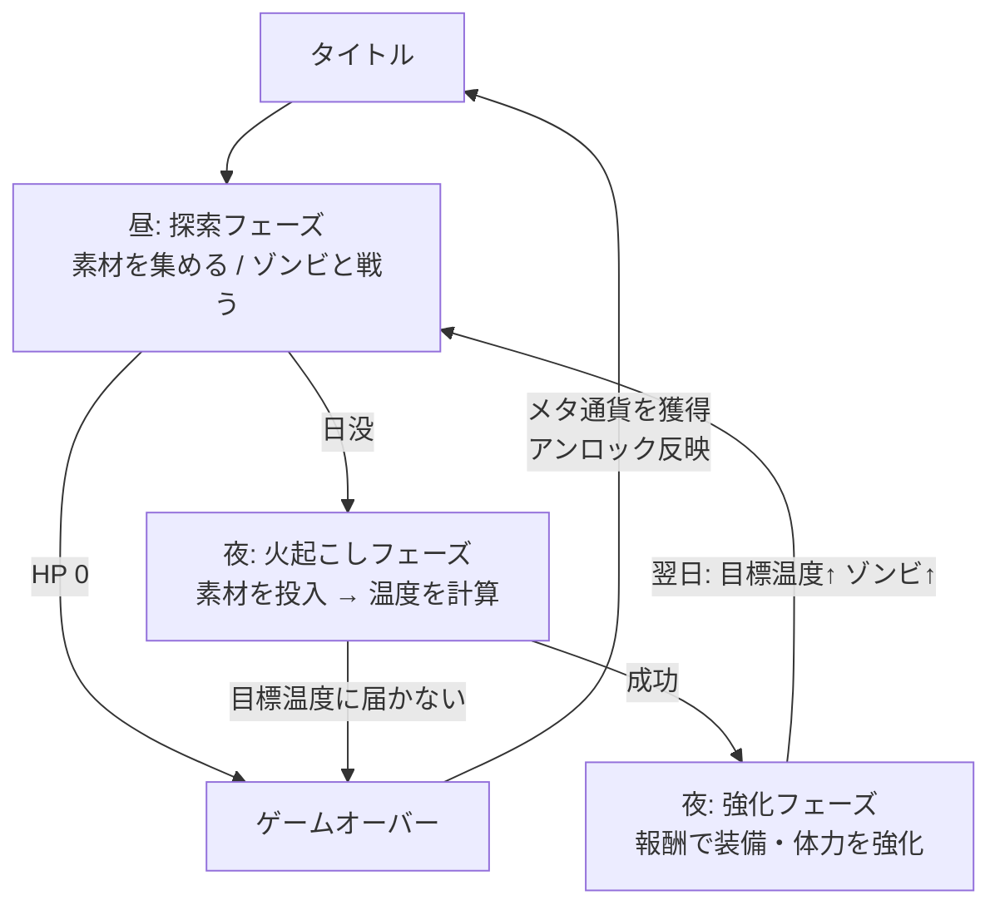

# FireStarting 開発方針

[rough.md](rough.md) の走り書きを整理・具体化したもの。設計判断はこの文書を正とし、変更する場合はここを更新する。

## 決定事項

| 論点 | 決定 | 理由 |
|---|---|---|
| 次元・視点 | 2D 見下ろし(トップダウン)。重力なし、高さ表現なし | 平面を自由に動き回る操作感を優先。rough.md の「テラリア的」は横視点ではなく「掘って集める2Dマップ」の意味と解釈する |
| マップ | ランごとに自動生成 | ローグライクとしてのリプレイ性。ベース版は単純なノイズ地形で十分 |
| アート | ピクセルアート(16px タイル) | タイルマップと相性がよく、少人数でも素材を量産しやすい |
| ローグライク要素 | 死んだらランは最初から。ランを跨いでアンロックが蓄積する | 失敗しても「次は何か増えている」状態にし、3日遊び続ける動機にする |
| ゲームの終わり | ベース版はエンドレス、生存日数がスコア | クリア条件の設計は拡張項目に回し、まずループの手触りを固める |

---

## 1. コンセプト

> 昼に集めて、夜に火を起こす。火がつかなければ、そこで終わり。

### ターゲットと設計原則

ターゲットは「小学生が夏休みにハマって3日くらいやり続ける」。これを次の原則に翻訳する。

- **短いラン、何度も遊ぶ**: 1ラン 15〜30分。1日(昼+夜)は 5〜8分を目安にする(数値は仮。→ 未決事項)
- **ボタンは少なく**: 移動 / 掘る / 攻撃 / 決定 の4操作以内(ジャンプなし)。キーボードとゲームパッドの両方に最初から対応する
- **文字より絵と数字**: 温度ゲージ、炎の大きさ、日没までの空の色など、読まなくてもわかる表現を優先する
- **失敗しても必ず何かが残る**: ラン終了時にメタ通貨を獲得し、次のランで使えるものが1つは増える

### ゲームの柱

1. **追われる採集** — 日没タイマーとゾンビに追われながら素材を集める緊張感
2. **火起こしの手応え** — 集めた素材の組み合わせで温度を作り、目標を超えたときの達成感
3. **積み上がる強さ** — ラン内の装備強化と、ランを跨ぐアンロックの二層で「強くなった」を感じさせる

---

## 2. コアループ



### 昼: 探索フェーズ

- 見下ろしの2Dマップを自由に歩き回り、木・岩・草むらを掘って(採取して)素材を集める
- ゾンビが妨害してくる。倒すか避けるかはプレイヤーの判断
- 日没タイマーが 0 になると強制的に夜へ移行する
- **出力**: インベントリ(集めた素材)、残り HP

### 夜: 火起こしフェーズ

- インベントリから「燃料」「火口」「着火補助」の3枠に素材を選んで投入する
- `FireCalculator` が投入した素材から到達温度を算出する
- 到達温度 >= その日の目標温度 なら成功。届かなければゲームオーバー
- **報酬**: 温度の超過分に応じた強化ポイント。ギリギリより余裕を持って燃やしたほうが得

### 夜: 強化フェーズ

- 強化ポイントで HP / 攻撃力 / 採掘速度 などを強化する
- 翌日は目標温度が上がり、ゾンビが増える。日を追うごとに厳しくなる

### ランの終了と周回

- 終了条件: HP が 0 になる、または火起こしに失敗する
- 終了時に生存日数と累計温度に応じてメタ通貨「灰」を獲得する
- 灰でアンロックを購入する(開始時の素材ボーナス、新素材の出現、初期 HP など)
- アンロック状況は `user://` に保存し、ランを跨いで引き継ぐ

---

## 3. ベース版 v0.1 "Ember" のスコープ

「様々な方向性に広げられるベース」を作ることが目的なので、ベース版は**ループが一周すること**だけに集中する。

### やる

- ノイズ生成による1バイオームの見下ろしマップ(床: 草地 / 土、障害物: 木 / 岩 / 草むら、外周は掘れない岩壁)
- プレイヤー: 8方向移動、掘る(採取)、近接攻撃
- 素材 3〜4種(例: 薪 = 燃料、枯れ草 = 火口、火打石 = 着火補助)
- ゾンビ 1種
- 日没タイマー
- 火起こし UI と温度計算、成功 / 失敗判定
- 強化 3項目(HP、攻撃力、採掘速度)
- ゲームオーバー画面 → タイトル
- 周回アンロック 1要素(開始素材ボーナス)
- メタ進捗のセーブ / ロード

### やらない(拡張フェーズへ)

- ラン途中のセーブ
- 複数バイオーム、洞窟、天候
- ボス、複数種の敵
- クラフト、装備の付け替え
- ストーリー、NPC
- マルチプレイ、モバイル対応

---

## 4. 拡張の方向性

ベース版は「データを足せば増える」「フェーズを足せば流れが変わる」構造にしておく。拡張軸ごとに触る場所を固定する。

| 拡張したいもの | 触る場所 | 備考 |
|---|---|---|
| 素材・ブロックの追加 | `data/items/*.tres`, `data/blocks/*.tres` | Resource を1つ足すだけ。コード変更なし |
| 敵の追加 | `data/enemies/*.tres` + `scenes/enemies/` | 挙動が違う敵はシーンを分ける |
| 火起こしの深化(湿度、風、レシピ) | `scripts/core/fire_calculator.gd` | 純粋関数なので差し替えやすい |
| バイオーム・洞窟・天候 | `scripts/core/map_generator.gd` | パラメータ追加かレイヤー追加で対応 |
| 強化項目・装備 | `data/upgrades/*.tres` | |
| 新フェーズ(例: 夜の襲撃防衛) | `PhaseManager` にフェーズを1つ登録 | 既存フェーズに手を入れない |
| クリア条件(N日目で脱出 等) | `GameState` に勝利判定を追加 | |

大きめの方向性としては、ボス戦、クラフト、協力プレイ、モバイル移植(Compatibility レンダラーへ切替)などが考えられる。いずれもベース版の構造を壊さずに載せられることを設計の判断基準にする。

---

## 5. 技術方針

### 環境

- Godot 4.7.2 stable
- GDScript、静的型付けを必須にする(`var hp: int`、戻り値の型を書く)
- 2D、レンダラーは現状の Forward+ を維持(モバイル展開時に Compatibility へ切替を検討)

### ピクセルアート設定

- タイルサイズ 16px
- 基準解像度 640x360(1080p で整数3倍。→ 480x270 との比較は未決事項)
- `rendering/textures/canvas_textures/default_texture_filter` を Nearest にする
- stretch は現状の `canvas_items` + `expand` を維持し、`scale_mode = integer` を試す

### アーキテクチャ

**Autoload(シングルトン)**

| 名前 | 責務 |
|---|---|
| `GameState` | ラン内の状態: 日数、インベントリ、HP、強化レベル、目標温度 |
| `PhaseManager` | フェーズの状態機械。`Main` 配下のフェーズシーンを差し替える |
| `EventBus` | フェーズやシーンを跨ぐシグナルの集約点 |
| `MetaProgress` | 周回アンロックと灰の残高。`user://meta.json` に保存 |

**フェーズ = シーン**

`DayPhase` / `FirePhase` / `UpgradePhase` をそれぞれ独立したシーンにし、`PhaseManager` が `Main.tscn` の下で入れ替える。フェーズ間の受け渡しは `GameState` 経由で行い、フェーズ同士は互いを知らない。

**データ駆動**

`Resource` のサブクラスでデータを定義し、実体は `.tres` として `res://data/` に置く。

- `ItemData`: 名前、アイコン、火起こしでの役割(燃料 / 火口 / 着火補助)、発熱量
- `BlockData`: タイル、硬さ(採掘にかかる時間)、ドロップする `ItemData`
- `EnemyData`: HP、攻撃力、移動速度、出現する最小日数
- `UpgradeData`: 名前、コスト、効果の種類と量
- `UnlockData`: 周回アンロック。灰のコストと、開始時に付与する素材や最大HPボーナス

**マップ**

`TileMapLayer` を2枚使う(`TileMap` は非推奨): `Ground`(床、当たり判定なし)と `Blocks`(木・岩などの障害物、当たり判定あり)。`MapGenerator` はノード非依存の純粋ロジックにして、seed を渡せば同じマップが出るようにする。

**火起こし計算**

`FireCalculator` は static メソッドだけの純粋関数クラスにする。ゲームの中核であり、テストの主対象。

**通信の原則**

- signal up, call down: 子は親にシグナルで伝え、親は子のメソッドを直接呼ぶ
- 深い `get_node("../../Foo")` は禁止。`@export` で参照を渡すか `%UniqueName` を使う
- フェーズを跨ぐ通知は `EventBus` のシグナルにする

### フォルダ構成

```
res://
├── scenes/
│   ├── main/        Main.tscn, Title.tscn, GameOver.tscn
│   ├── phases/      DayPhase.tscn, FirePhase.tscn, UpgradePhase.tscn
│   ├── player/
│   ├── enemies/
│   ├── world/       World.tscn(Ground / Blocks の TileMapLayer を持つ)
│   └── ui/
├── scripts/
│   ├── autoload/    game_state.gd, phase_manager.gd, event_bus.gd, meta_progress.gd
│   ├── core/        fire_calculator.gd, map_generator.gd(ノード非依存)
│   └── data/        item_data.gd, block_data.gd, enemy_data.gd, upgrade_data.gd
├── data/
│   ├── items/
│   ├── blocks/
│   ├── enemies/
│   ├── upgrades/
│   └── unlocks/
├── assets/
│   ├── sprites/
│   ├── audio/
│   └── fonts/
├── tests/           headless で実行する検証スクリプト
└── tools/           gen_placeholder_art.gd(プレースホルダー画像の生成)
```

### コーディング規約

- 公式 GDScript スタイルガイドに従う(snake_case の変数・関数、PascalCase のクラス、インデントはタブ)
- シーンとスクリプトは同名ペアにして同じフォルダに置く(`Player.tscn` と `player.gd`)
- 再利用するスクリプトには `class_name` を付ける
- 1シーン1責務。肥大化したら子シーンに分割する
- コメントは「なぜ」が自明でないときだけ書く

### 入力マップ(M0 で定義)

| アクション | キーボード | ゲームパッド |
|---|---|---|
| `move_left` / `move_right` | A / D、← / → | 左スティック、十字キー |
| `move_up` / `move_down` | W / S、↑ / ↓ | 左スティック、十字キー |
| `dig` | J | X ボタン(左) |
| `attack` | K | B ボタン(右) |
| `interact` | E | Y ボタン(上) |
| `pause` | Esc | Start |

### 物理レイヤー名

| 番号 | 名前 |
|---|---|
| 1 | world |
| 2 | player |
| 3 | enemy |
| 4 | item |
| 5 | player_hitbox |
| 6 | enemy_hitbox |

### セーブ

- メタ進捗(灰の残高、アンロック状況、最高生存日数)のみ `user://meta.json` に JSON で保存する
- ラン途中のセーブは非対応。必要になったら `GameState` をシリアライズする方針で拡張する

### テスト

- `FireCalculator` と `MapGenerator` はノード非依存にし、スクリプトから直接呼んで検証できるようにする
- テストフレームワーク(GUT 等)の導入は M2 で温度計算が固まった時点で判断する

### MCP 駆動の開発ワークフロー

godot-mcp が接続されているので、Godot エディタの操作は原則 MCP ツールで行う。

| やりたいこと | 使うツール |
|---|---|
| シーンの新規作成、ノード追加 | `create_scene`, `add_node`, `save_scene` |
| スプライトの配置 | `load_sprite` |
| プロジェクトの実行・停止 | `run_project`, `stop_project` |
| 実行中のログ・エラー確認 | `connect_remote_debugger` → `get_remote_debug_output` |
| 見た目の確認 | `capture_screenshot` |
| プロジェクト情報の確認 | `get_project_info`, `get_godot_version` |

MCP ツールで扱えないもの(`.tres` の中身、`project.godot` の細かい設定、スクリプト本文、TileSet の定義)はファイルを直接編集する。どちらで作ったかに関わらず、動作確認は必ず `run_project` + リモートデバッガで行う。

### バージョン管理

`git init` 済み。マイルストーンごとに区切りのコミットを作る。

---

## 6. ロードマップ

| M | 内容 | 完了条件 |
|---|---|---|
| M0 | 土台: `git init`、入力マップ、物理レイヤー名、テクスチャフィルタ、フォルダ骨格、Autoload 4つ、`Main.tscn` とフェーズ切替のスタブ、`run/main_scene` の設定 | 空のフェーズが 昼 → 夜 → 強化 → 昼 とループする |
| M1 | 昼フェーズ: `MapGenerator` + `TileMapLayer`、プレイヤーの8方向移動 / 掘る、アイテム拾得、日没タイマー | 素材を集めて日没を迎えられる |
| M2 | 火起こし: `FirePhase` UI、`FireCalculator`、成功 / 失敗判定、ゲームオーバー画面 | 集めた素材で火がつく / つかないが決まる |
| M3 | ゾンビと戦闘: 敵 1種、近接攻撃、HP、被ダメージ、死亡 | 昼に「追われている」緊張感がある |
| M4 | 強化と複数日: `UpgradePhase`、日ごとの目標温度とゾンビ数のスケーリング | 3日以上のランが成立する |
| M5 | 周回とタイトル: `MetaProgress`、灰の獲得とアンロック、タイトル画面、セーブ / ロード | ゲームとして一周でき、2周目に変化がある |
| M6 | 見た目と音: ピクセルアートの差し替え、SE / BGM、炎の演出 | v0.1 "Ember" として人に渡せる |

M6 完了後、できれば実際に小学生に遊んでもらってプレイテストし、次の拡張軸を決める。

---

## 7. 未決事項

- 温度計算式の具体値。素材ごとの発熱量と、目標温度の日ごとの伸び方
- 1日の秒数(昼の長さ)とマップのサイズ
- 基準解像度の最終決定(640x360 か 480x270 か)
- 周回アンロックの具体的なリストと灰の価格
- メタ通貨「灰」を含む世界観の言葉づかい(ゾンビの呼び名、素材名など)
